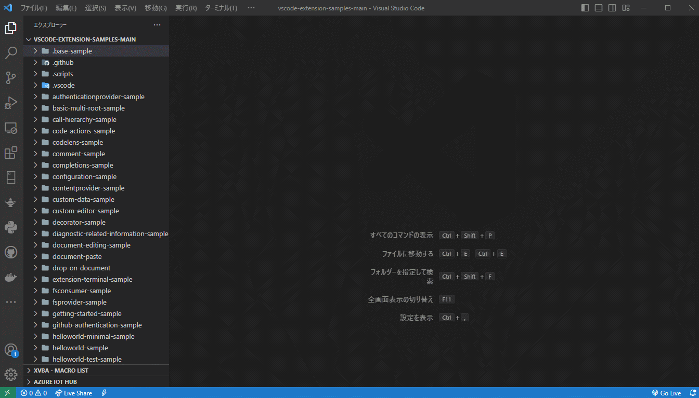

# FindFiles

Search for files in your workspace based on a pattern and display files that do not match the exclusion criteria.

## Features

- Search for files in your workspace by entering a pattern and exclusion criteria.
- Use wildcards in the pattern and exclusion criteria.
- The pattern determines whether a file name matches.
- The exclusion criteria determines whether a file name does not match.

## Usage

1. Press `Ctrl+Shift+P` or `F1` to open the command palette.
2. Search for and select the `FindFiles` command.
3. Enter the `Pattern` for the file names you want to search for.
4. Enter the `Exclude` for the file names you want to exclude.
5. Click the `Exec` button to start the search.
6. The search results will be displayed.

## Example

Suppose you want to search for JavaScript files in your workspace, excluding any files with the name `test`. Here's how you would use the extension:

1. Enter `*.js` in the `Pattern` field.
2. Enter `test.*` in the `Exclude` field.
3. Press Enter or click the `Search` button.

The extension will search for JavaScript files in your workspace, excluding any files with the name `test`. The search results will be displayed.

## Requirements

- Visual Studio Code 1.60.0 or newer

## License

Licensed under MIT
